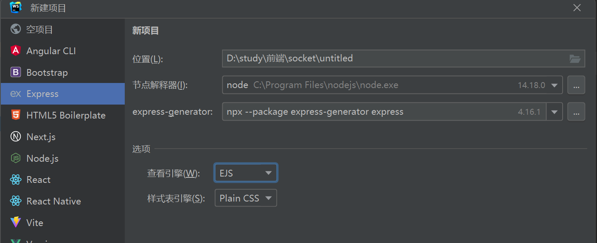

##  运用技术
    框架：express+node+websocket
    数据库：mongodb
    node: 14.18.0 
## 插件

	邮件发送：nodemailer
	密码加密: bcryptjs
	数据库连接：mongoose
	token: jsonwebtoken

##  express项目新建

##  mongodb安装

参考地址：https://blog.csdn.net/xhmico/article/details/126566220

## 问题记录

**环境方面**

1、服务端socket.io与客户端socket.io-clent兼容问题

​		socket.io 最新^4.X

​		socket.io-clent最新^3.X

​		兼容产生的问题导致通讯消息无法返回

vue-socket.io 客户端接收不到服务端消息,最新的^3.0.10版本$socket报错

vue3最佳方案 socket.io+socket.io-clent 都改成^2.x版本

vue2最佳方案 socket.io+weapp.socket.io 都改成^2.x版本

**服务端问题**

mongoose遍历查询语句插入数据会报错
参考方案：   https://blog.csdn.net/shuhaha/article/details/78200093
